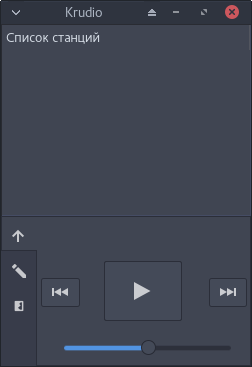
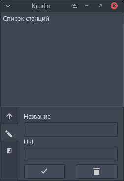
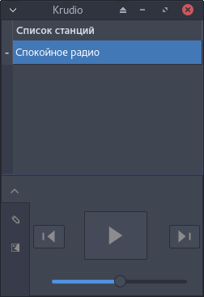

# krudio
Radio tray for linux on QT

# Screenshots

# Install from AUR
- $ yaourt -S krudio-git

# Install for Ubuntu and openSUSE
- openSUSE package: https://software.opensuse.org/download.html?project=home%3ADarkSS&package=krudio
- Ubuntu package: https://software.opensuse.org/download.html?project=home%3ADarkSS%3Adeb&package=krudio

# Install and run
- $ git clone https://github.com/loast/krudio.git
- $ cd krudio
- $ make
- $ sudo make install

# Run this app in menu or terminal
- $ krudio

# DONATE
- https://loast.github.io/
